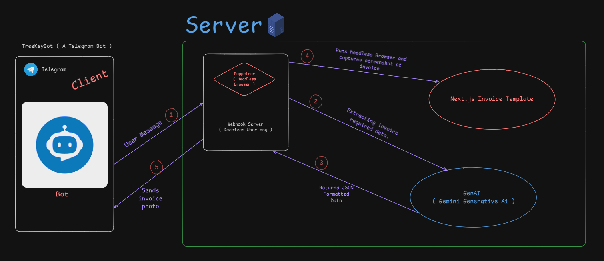

# 📃 **BillBot - AI-powered Invoice Generator**

🚀 BillBot is an AI-powered Telegram bot that extracts structured data from text messages, generates professional invoices using Next.js, and delivers them as images via a webhook. It leverages GenAI for data extraction, Puppeteer for rendering, and is optimized for Vercel deployment.

## 🛠️ **Tech Stack**

| Technology  | Purpose |
| ------------- | ------------- |
| Node.js & Express  | Backend for handling Telegram webhooks  |
| Puppeteer + @sparticuz/chromium  | Generates invoice images using headless Chromium |
| GenAI ( Google's Gemini ) | Extracts structured data from user messages |
| Next.js  | Renders the invoice dynamically |
| Telegram Bot API  | Receives & Sends messages from users |
| Vercel  | Deployment for both webhook, invoice rendering and Next.js |
| TypeScript  | Ensure Typesafe |

---
# Architecture


# Demo Result


# Demo Video
<video src="./webhook/assets/Demo-video.mp4" height="500px">
---

## 📌 Features
- ✅ **AI-powered Data Extraction** - Uses GenAI to structure invoice details.
- ✅ **Beautiful Invoice Rendering** - Uses Next.js for frontend rendering.
- ✅ **Real-time Telegram Bot** - Handles messages and replies instantly.
- ✅ **Puppeteer Image Generation** - Converts invoices to high-quality images.
- ✅ **Serverless Deployment** - Runs efficiently on Vercel.

---
## Sample .env

```
# Telegram Bot
TELEGRAM_BOT_TOKEN=your-telegram-bot-token

# Puppeteer (for invoice generation)
CHROME_EXECUTABLE_PATH=/tmp/chromium 

# OpenAI / Genkit API Key (for AI-based data extraction)
OPENAI_API_KEY=your-api-key

```

---
## Sample from user
```
Radhe Krishna
+91 1234567890
Face Wash x4 100
Dandruff Shampoo x2 300
Shipping 40

```